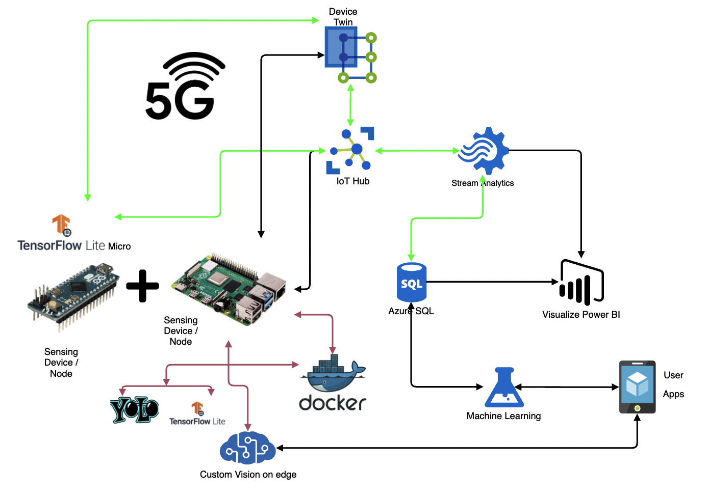

## Counting People, Cars, Bikes in GreenAreas at UBC point grey Campus 

### to do
* [x] Convert YOLOv4 tiny (Coco Dataset) to TFLite
* [ ] Custom train Yolov4 (tiny) on darknet for specific use-cases
* [x] Convet into quantized model (float16)
* [x] Run customized settings on RPi4 to run Y-v4 Tiny and TFLite
* [x] Filter data before uploads
* [ ] Upload data into Azure database 
* [ ] energy optimization on the pi. 
* [ ] 5G module integration
* [ ] Docker containers for use-case dependecnies, including models

## General overview
\

## Running TFLite on RPi. PRi uploads 
# Yolov4 on COCO dataset --> TFLite
Will most likely be inefficient to run on the pi. 

Depenecy: Tensoflow 2.4 (current default on colab) will not work.
!pip install tensorflow==2.3.0 (used colab for conversions)

Converting Yolov4 to TF works fine on TF 2.4. 
However it will not convert to TFLite. Will work on TF 2.3

# differences in dependancies on RPi
 After installing OpenCV depnencies:
 pip3 install opencv-python==3.4.6.27 

TF version on the Pi needs to be TF 2.2 or 2.3 (the ARM devices version)

# Yolov4 with Class Count Displayed in Video
source: https://github.com/hunglc007/tensorflow-yolov4-tflite
source: https://github.com/theAIGuysCode/yolov4-custom-functions
source: https://github.com/JasonHarambe/Yolov4-with-class-count

## Steps to run:
1. Clone the repo
##### Get pre-trained weight (AlexeyAB's darkent yolov4 weights)
2. wget https://github.com/AlexeyAB/darknet/releases/download/darknet_yolo_v3_optimal/yolov4.weights
3. cd into repo folder
##### convert pre-trained weight to Tensorflow format ( a lot faster in colab)
4. python3 save_model.py --weights ./yolov4.weights --output ./checkpoints/yolov4-416 --input_size 416 --model yolov4 

#### 4.b. Convert pre-trained --Tiny-- weights to Tensorflow (still very slow on the Pi..)
4.  python3 save_model.py --weights ./data/yolov4-tiny.weights --output ./checkpoints/yolov4-tiny-416 --input_size 416 --model yolov4 --tiny

##### convert pre-trained Yolov4 weight to TFLite and TFLite quantized
5. 
##### Save tf model for tflite converting
python3 save_model.py --weights ./yolov4.weights --output ./checkpoints/yolov4-416 --input_size 416 --model yolov4 --framework tflite

##### actual conversion from yolov4 to TFLite
python3 convert_tflite.py --weights ./checkpoints/yolov4-416 --output ./checkpoints/yolov4-416.tflite

##### actual conversion from yolov4 to TFLite (quantize float16)
python3 convert_tflite.py --weights ./checkpoints/yolov4-416 --output ./checkpoints/yolov4-416-fp16.tflite --quantize_mode float16

## Detection:

### image detection (using TF- converted from yolov4)  
!python detect.py --weights ./checkpoints/yolov4-416 --size 416 --model yolov4 --image ./data/kite.jpg --output /content/result.jpg --count
\
\

### image detection (using TF- converted from Yolov4 Tiny)  
python3 detect.py --weights ./checkpoints/yolov4-tiny-416 --size 416 --model yolov4 --image ./data/kite.jpg --tiny --count

### image detection (using TFLite framework)  
python3 detect.py --weights ./checkpoints/yolov4-416.tflite --size 416 --model yolov4 --image ./data/kite.jpg --output ./result.jpg --framework tflite --count

### image detection (using TFLite -quantized framework)  
python3 detect.py --weights ./checkpoints/yolov4-416-fp16.tflite --size 416 --model yolov4 --image ./data/kite.jpg --output ./result.jpg --framework tflite --count

## SSD TFLite Coco dataset model:
Google's ssd rflite model 

## GDPR, ethical/ data AI approach: fitler data on Edge device before uploading data to Azure

## Docker:
* most likely to be the easiest way to maintain the latest custom vision model. [maintain == retrain models further, with additional accumulated data]
* run/interchange multiple models on the same node